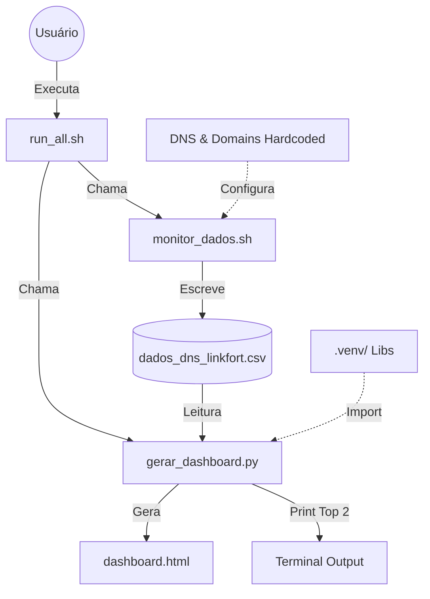

# 🧩 Análise de Interações de Arquivos: Projeto Linkfort

Visão geral de como os componentes do repositório interagem para entregar o dashboard de DNS.

## 🗺️ Mapa de Dependências

## 📂 Descrição dos Arquivos

### 🚀 Core (Produção v3.0)
Estes arquivos compõem o pipeline principal implementado recentemente.

| Arquivo | Tipo | Função | Entradas | Saídas |
| :--- | :--- | :--- | :--- | :--- |
| `monitor_dados.sh` | Bash | **Coletor**. Executa `dig` em loop para medir latência. | Lista de IPs interna | `dados_dns_linkfort.csv` |
| `dados_dns_linkfort.csv` | Data | **Banco de Dados**. Histórico de latências e status. | *Output do Monitor* | *Input do Analyzer* |
| `gerar_dashboard.py` | Python | **Analisador**. Calcula P95, Mediana e gera visualização. | `dados_dns_linkfort.csv` | `dashboard.html` |
| `dashboard.html` | Relatório | **Visualização**. Gráficos interativos para o usuário. | *Output do Analyzer* | Visualização Browser |

### 🛠️ Orquestração & Infra
Arquivos que facilitam o uso e configuração.

| Arquivo | Tipo | Função |
| :--- | :--- | :--- |
| `run_all.sh` | Bash | Script "One-Click". Limpa dados antigos, roda o monitor por X segundos e depois gera o dashboard. Provável ponto de entrada padrão. |
| `.venv/` | Dir | Ambiente virtual Python. Contém `pandas`, `plotly` isolados do sistema. |
| `requirements.txt` | Config | Lista de libs Python necessárias (`pandas`, `plotly`). |

### 🕰️ Legado / Auxiliares (Observados)
Arquivos presentes no diretório, mas que parecem ser de versões anteriores ou experimentais.

| Arquivo | Status | Observação |
| :--- | :--- | :--- |
| `iplinkfort.sh` | Legado | Script original (v1.0) usando apenas `ping`. |
| `analisar.py` | Deprecado? | Provável versão anterior do analisador. |
| `analisar_ranking.py` | Deprecado? | Outra variação de análise. |
| `diagnostico.py` | Tool | Ferramenta para debug de problemas de rede específicos? |
| `top3.py` | Tool | Script focado apenas em imprimir o Top 3 (simples). |
| `ranking_tabela.py` | Tool | Gera apenas tabelas no terminal? |

## 🔄 Fluxo de Dados Detalhado

1. **Início**: O usuário (ou cron) executa `monitor_dados.sh` (direta ou via `run_all.sh`).
2. **Coleta**: O script Bash itera sobre IPs e Domínios.
    - Para cada par (IP, Domínio), executa `dig`.
    - Captura tempo de resposta (ms) ou Timeout.
    - **Interação Crítica**: O Bash usa *append* (`>>`) no CSV para garantir persistência imediata.
3. **Persistência**: `dados_dns_linkfort.csv` acumula linhas.
    - Formato: `timestamp,dns_name,dns_ip,domain,latency_ms,status`
4. **Análise**: O script `gerar_dashboard.py` é acionado.
    - Lê todo o CSV com Pandas.
    - Filtra erros e calcula estatísticas agrupadas.
5. **Entrega**:
    - **Console**: Imprime texto simples com os vencedores.
    - **HTML**: Grava arquivo estático com gráficos Plotly embutidos (standalone).

## ⚠️ Aspectos Importantes
- **Acoplamento Fraco**: O Coletor (Bash) não sabe nada sobre Python. O Analisador (Python) não sabe como os dados foram coletados, apenas lê o CSV e espera um esquema. Isso é bom para manutenção.
- **Dependência de Arquivos**: Se o CSV for corrompido (ex: múltiplas instâncias escrevendo ao mesmo tempo sem lock), o script Python falha (como visto anteriormente). A robustez foi adicionada no Python para lidar com headers ausentes.
