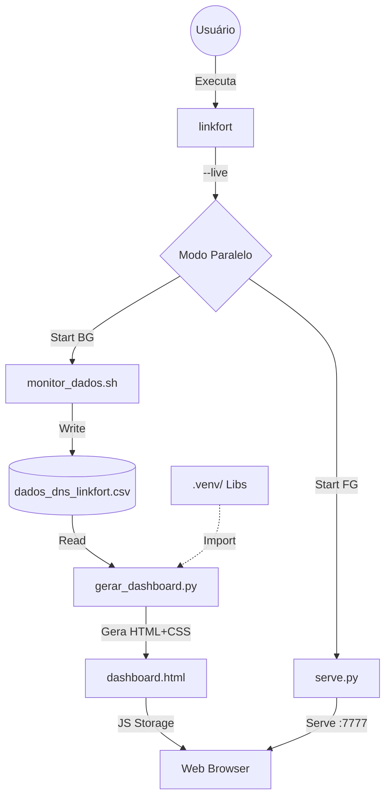

# 🧩 Arquitetura do Linkfort DNS (V3.4)

Este documento reflete a estrutura de código limpa e os componentes de software em produção, incluindo a camada de apresentação visual.

## 🗺️ Mapa de Dependências

## 📂 Componentes Principais

### 🚀 Orquestração (`linkfort`)
O ponto de entrada único do sistema (antigo `run_all.sh`).
- **Função**: CLI Unificada.
- **Responsabilidades**:
    - **Diagnóstico**: Verifica versões de Python/Pip e integridade do venv na inicialização.
    - **Gestão**: Controla processos (Monitor+Server), estima tempo de coleta e realiza Reset de dados.

### 📡 Coleta (`monitor_dados.sh`)
O worker de I/O.
- **Tecnologia**: Bash + `dig`.
- **Estratégia**: Execução sequencial com throttling (0.5s) e detecção automática de ambiente Python.

### 🧠 Análise & Visualização (`gerar_dashboard.py`)
O motor de inteligência e design.
- **Analytics**: Calcula Score V3.0 (P95/Mediana).
- **Design Engine**: Injeta CSS (Dark Mode, Glassmorphism) e constrói o HTML final.
- **Plotly Integration**: Gera gráficos vetoriais interativos no tema escuro.

### 🌐 Servidor (`serve.py`)
O entregador de experiência.
- **Tecnologia**: Python `http.server`.
- **Porta**: 7777.
- **UX**: Banner ASCII no terminal e abertura automática do navegador padrão.
    
### 🛡️ Resiliência e Auto-Healing
O sistema é projetado para ser **Stateless** na inicialização:
- Se `dados_dns_linkfort.csv` não existir (pós-reset), ele é recriado automaticamente com os headers corretos.
- Se `dashboard.html` não existir, ele é gerado do zero na próxima análise.
- **Conclusão:** O comando `--reset` é seguro pois o sistema sabe se reconstruir.

## 💾 Fluxo de Dados Final

1.  **Coleta**: `monitor_dados.sh` gera dados brutos em CSV.
2.  **Processamento**: Python lê CSV, limpa e aplica algoritmo de Score.
3.  **Renderização**: Python constrói string HTML com CSS "Glass" e Gráficos.
4.  **Persistência**: Gravação de `dashboard.html`.
5.  **Entrega**: Servidor HTTP disponibiliza arquivo e invoca cliente (Browser).
6.  **Manutenção**: Comando `--reset` permite purgar dados históricos para novos ciclos de teste.
