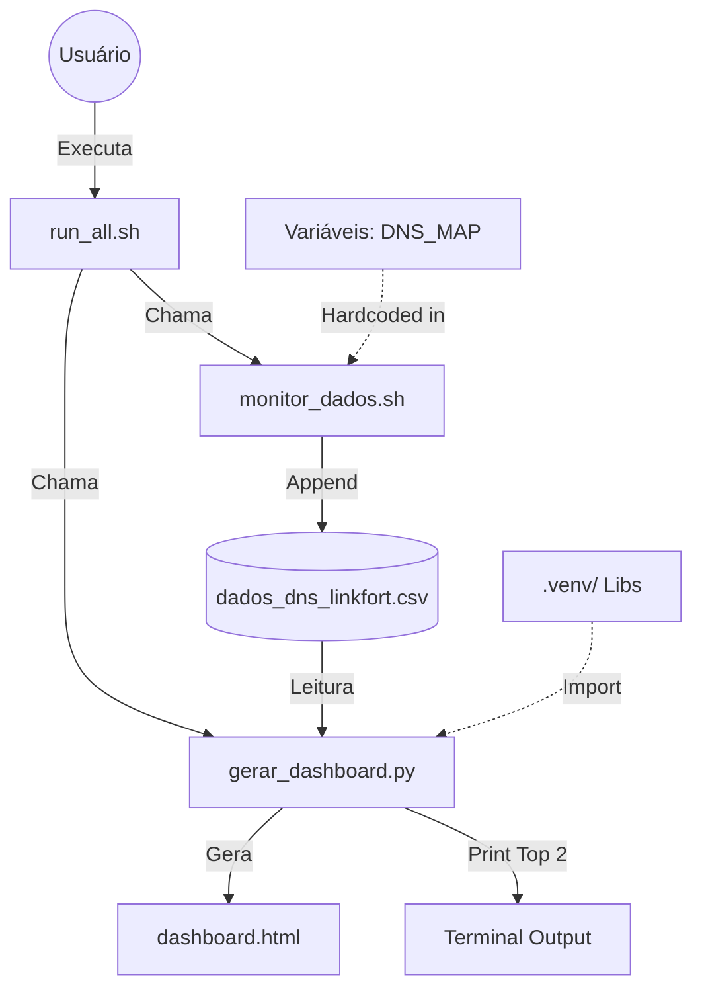

# 🧩 Arquitetura do Linkfort DNS (V3.0)

Este documento reflete a estrutura de código limpa e os componentes de software em produção.

## 🗺️ Mapa de Dependências

## 📂 Componentes Principais

### 🚀 Orquestração (`run_all.sh`)
O ponto de entrada único do sistema.
- **Função**: Gerenciamento de Ciclo de Vida.
- **Responsabilidades**:
  - Validar/Criar ambiente virtual Python (`.venv`).
  - Instalar dependências (`requirements.txt`).
  - Interpretar flags CLI (`--test`, `--collect`).
  - Chamar a coleta e depois a análise.

### 📡 Coleta (`monitor_dados.sh`)
O "trabalhador" de baixo nível.
- **Tecnologia**: Bash + `dig`.
- **Estratégia**: I/O Bound.
- **Mitigação**: Usa `sleep 0.2` para evitar saturação de buffer em roteadores domésticos.
- **Persistência**: Escrita direta em CSV para evitar perda de dados em caso de crash.

### 🧠 Análise (`gerar_dashboard.py`)
O "cérebro" estatístico.
- **Tecnologia**: Python (Pandas/Plotly).
- **Algoritmo**: Implementa a lógica de Score V3.0 (ver `FLUXO_TECNICO.md` para a matemática).
- **Robustez**: Capaz de reconstruir headers de CSV ausentes e ignorar linhas corrompidas.

## 💾 Fluxo de Dados

1.  **Input**: Lista de IPs hardcoded no Hash Map do Bash.
2.  **Processo 1**: `dig` retorna tempo em ms.
3.  **Storage**: CSV Schema -> `timestamp,dns_name,dns_ip,domain,latency_ms,status`
4.  **Processo 2**: Pandas carrega CSV -> `GroupBy` -> `Agg` (P95, Median).
5.  **Output**: HTML estático (Dashboard) + STDOUT (Resumo).
