# 🧩 Arquitetura do Linkfort DNS (V3.4)

Este documento reflete a estrutura de código limpa e os componentes de software em produção, incluindo a camada de apresentação visual.

## 🗺️ Mapa de Dependências

```mermaid
graph TD
    %% Nós de Entrada e Configuração
    User((Usuário))
    CLI[linkfort]
    
    %% Camada de Coleta
    Monitor[monitor_dados.sh]
    RawData[(dados_dns_linkfort.csv)]
    
    %% Camada de Processamento
    Analyzer[gerar_dashboard.py]
    Venv[.venv/ Libs]
    
    %% Camada de Servidor
    Server[serve.py]
    Browser[Web Browser]
    
    %% Fluxo
    User -->|Executa| CLI
    
    CLI -->|--live| Parallel{Modo Paralelo}
    Parallel -->|Start BG| Monitor
    Parallel -->|Start FG| Server
    
    Monitor -->|Write| RawData
    
    RawData -->|Read| Analyzer
    Venv -.->|Import| Analyzer
    
    Analyzer -->|Gera HTML+CSS| Dashboard[dashboard.html]
    Dashboard -->|JS Storage| Browser
    
    Server -->|Serve :7777| Browser
```

## 📂 Componentes Principais

### 🚀 Orquestração (`linkfort`)
O ponto de entrada único do sistema (antigo `run_all.sh`).
- **Função**: CLI Unificada.
- **Responsabilidades**: Configurar ambiente, gerenciar processos (Monitor+Server), e limpar recursos.

### 📡 Coleta (`monitor_dados.sh`)
O worker de I/O.
- **Tecnologia**: Bash + `dig`.
- **Estratégia**: Execução sequencial com throttling (0.5s) e detecção automática de ambiente Python.

### 🧠 Análise & Visualização (`gerar_dashboard.py`)
O motor de inteligência e design.
- **Analytics**: Calcula Score V3.0 (P95/Mediana).
- **Design Engine**: Injeta CSS (Dark Mode, Glassmorphism) e constrói o HTML final.
- **Plotly Integration**: Gera gráficos vetoriais interativos no tema escuro.

### 🌐 Servidor (`serve.py`)
O entregador de experiência.
- **Tecnologia**: Python `http.server`.
- **Porta**: 7777.
- **UX**: Banner ASCII no terminal e abertura automática do navegador padrão.

## 💾 Fluxo de Dados Final

1.  **Coleta**: `monitor_dados.sh` gera dados brutos em CSV.
2.  **Processamento**: Python lê CSV, limpa e aplica algoritmo de Score.
3.  **Renderização**: Python constrói string HTML com CSS "Glass" e Gráficos.
4.  **Persistência**: Gravação de `dashboard.html`.
5.  **Entrega**: Servidor HTTP disponibiliza arquivo e invoca cliente (Browser).
